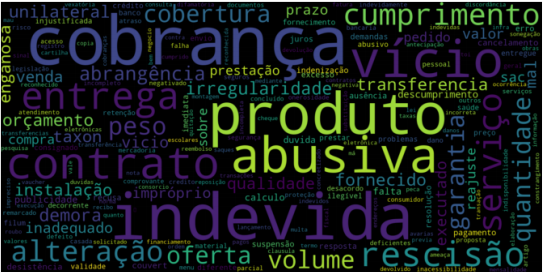

# BUSINESS INTELLIGENCE NLP PROJECT

This project consists on working with reported complains about important companies and services in Brasil on 2017. The goal of the project is to know the data and learn more about it through Natural Language Processing (NLP) techniques.

All the project is writen in Portuguese.

The database was provided by the teacher in a .csv file and shows data with region, state, company, subsidiaries, area, service, problem and user's age range.

The whole project was done in Jupyter Notebook.

Some pre-processing techniques were necessary to work with clean data. I've removed null answers, dropped NAs and formatted the text initially.

Afterwards, I've used Tokenization, removed stopwords, Stemming/Lemmatization, Part-of-speech tagging and plotted some graphs to learn about the data.

The final challenge was to create three Wordcloud of most common words used in those complaints reports filtered by companies, state and service, as shown below.

  

